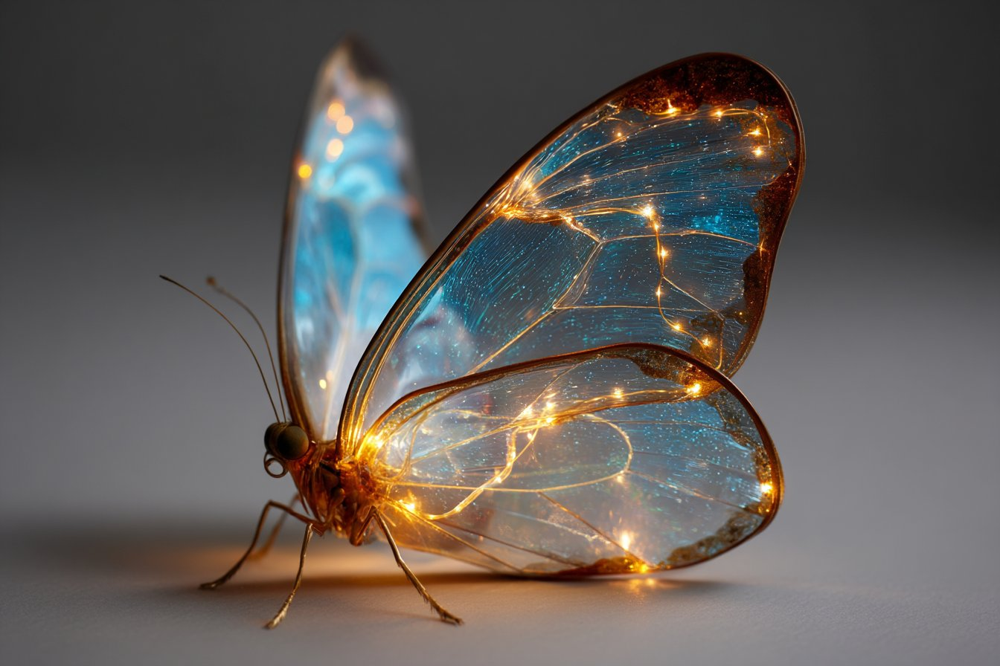

## Bioluminescenza

### Prompt Base

```txt
[SUBJECT] revealed through a Bioluminescent Flow, with gentle arcs of glow tracing organic rhythms and natural movements.

Select [COLOR1] and [COLOR2] to bring out the subtle, life-like pulses of radiance within the scene.
```

### Esempio Midjourney

```txt
Butterfly revealed through a Bioluminescent Flow, with gentle arcs of glow tracing organic rhythms and natural movements.

Select cerulean blue and golden amber to bring out the subtle, life-like pulses of radiance within the scene --ar 3:2 --v 7.0.
```

---

### Output



---

- Fonte: [LudovicCreator](https://x.com/LudovicCreator)

