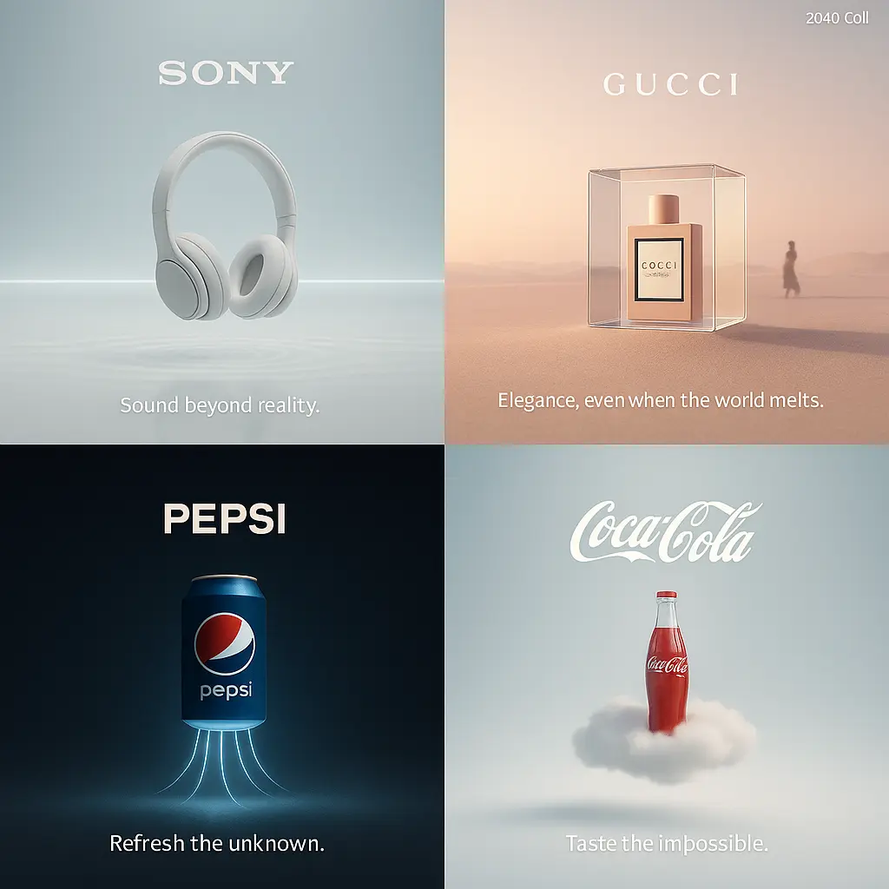

## Titolo

```txt
Create a surreal, minimalist, futuristic 3D advertisement for [brand name], imagined in the year 2040.

Center a single branded object in a clean, dreamy environment with soft ambient lighting and subtle surreal elements.

Incorporate visual metaphors that reflect the brand’s identity in unexpected ways — such as floating, glowing, bending physics, or dreamlike distortion.

Use elegant negative space, soft shadows, ambient glow, and futuristic textures. Style: cinematic, poetic, ethereal.

Aspect ratio: 1:1, high detail.
```

---

## Immagine di riferimento



---

- Fonte: [Aziz AI](https://x.com/aziz4ai)

