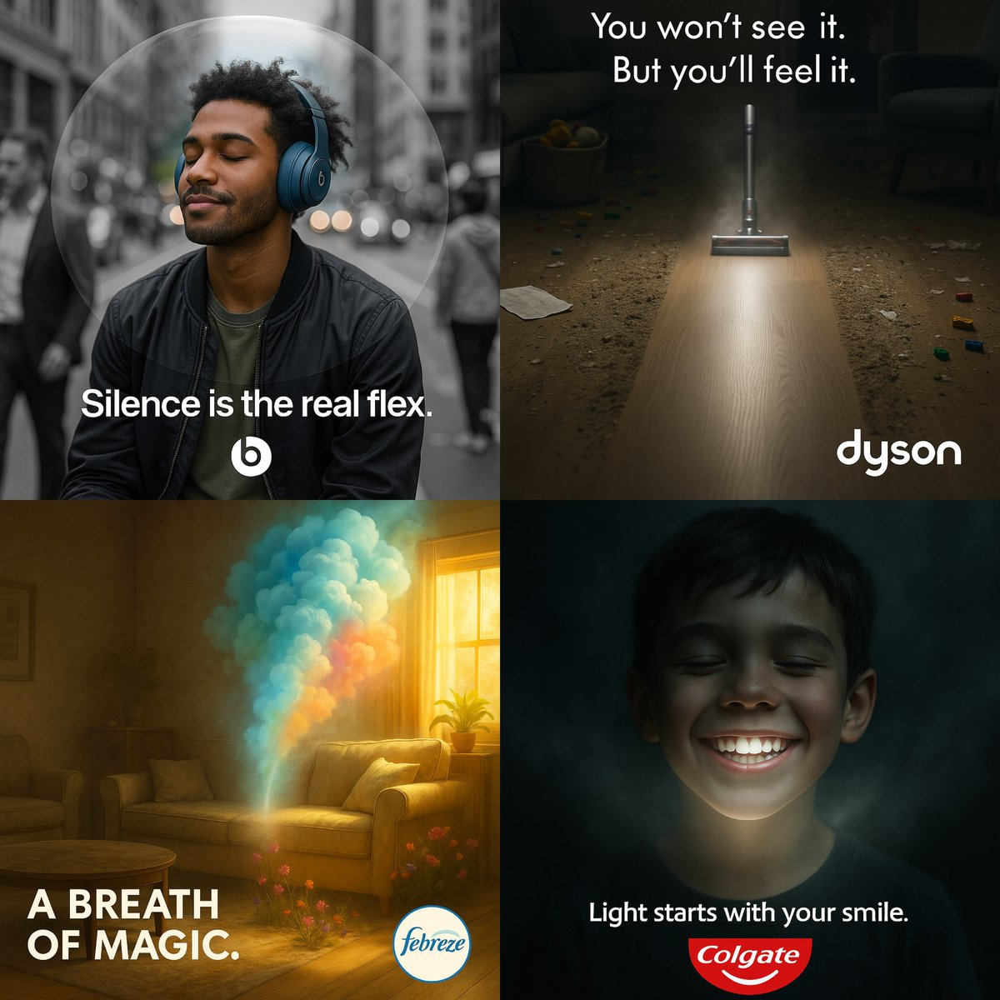

## Brand It

```txt
Create a cinematic surreal 1:1 advertisement for [brand name].

Do not show the product directly. Instead, reveal its presence through its effect on the scene — such as clarity, color, motion, light, or emotional reaction.

The environment must highlight a sharp contrast between before/after, inside/outside, or touched/untouched areas.

Reflect the core essence of the brand and its product through mood, lighting, symbolism, and visual storytelling.

Generate a unique slogan inspired by the brand identity.
Include the brand logo in a subtle, elegant way.
```

---

## Immagine di riferimento



---

- Fonte: [Aziz AI](https://x.com/aziz4ai)

