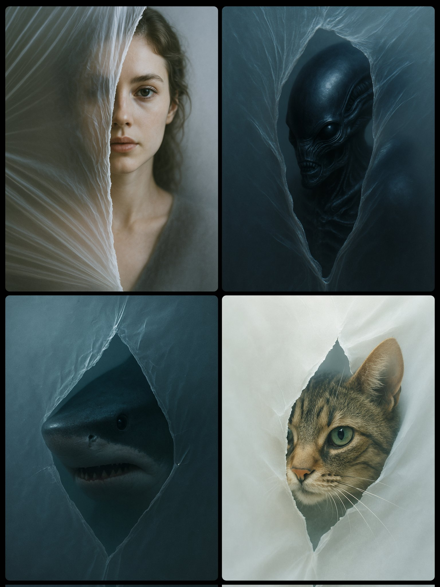

## Dietro un velo

```txt
A conceptual, cinematic portrait of a [SUBJECT], partially visible through a jagged, irregular tiny tear in a sheet of semi-transparent, frosted material. The tear reveals sharply detailed features, while the rest of the form is obscured behind the foggy surface. The surrounding plastic appears stretched and pulled, creating tension around the opening. Lighting is soft and diffused, casting cool, bluish tones and deep shadows, evoking a surreal, mysterious, and unsettling atmosphere.
```

---

## Immagine di riferimento



- Fonte: [UmeshAI](https://x.com/umesh_ai)