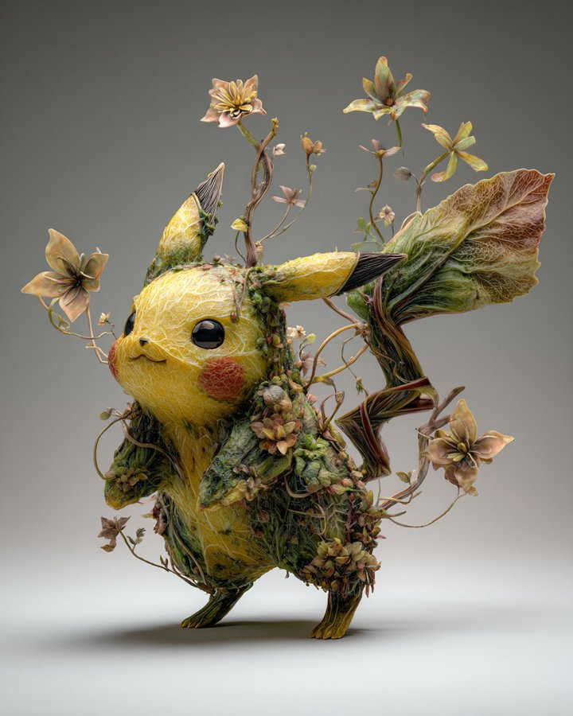

# Fusione Botanica

## Prompt Base

```txt
The [subject] appears organically grown from plants, flowers, and vines. Leaf-like textures, blooming shapes, and natural asymmetry merge with anatomy or design, creating a dreamlike hybrid.
```

### Esempi dettagliati con pesi MJ7

```txt
The floral android appears organically grown from plants, flowers, and vines. Leaf-like textures, blooming shapes, and natural asymmetry merge with anatomy or design, creating a dreamlike hybrid. --ar 3:2
```

```txt
The moss-covered warrior appears organically grown from plants, flowers, and vines. Leaf-like textures, blooming shapes, and natural asymmetry merge with anatomy or design, creating a dreamlike hybrid. --ar 3:2
```

```txt
The floral samurai appears organically grown from plants, flowers, and vines. Leaf-like textures, blooming shapes, and natural asymmetry merge with anatomy or design, creating a dreamlike hybrid. --ar 3:2
```

```txt
The guardian of the glade appears organically grown from plants, flowers, and vines. Leaf-like textures, blooming shapes, and natural asymmetry merge with anatomy or design, creating a dreamlike hybrid. --ar 3:2
```

### Immagine per stile di riferimento



---

- Fonte: https://x.com/azed_ai