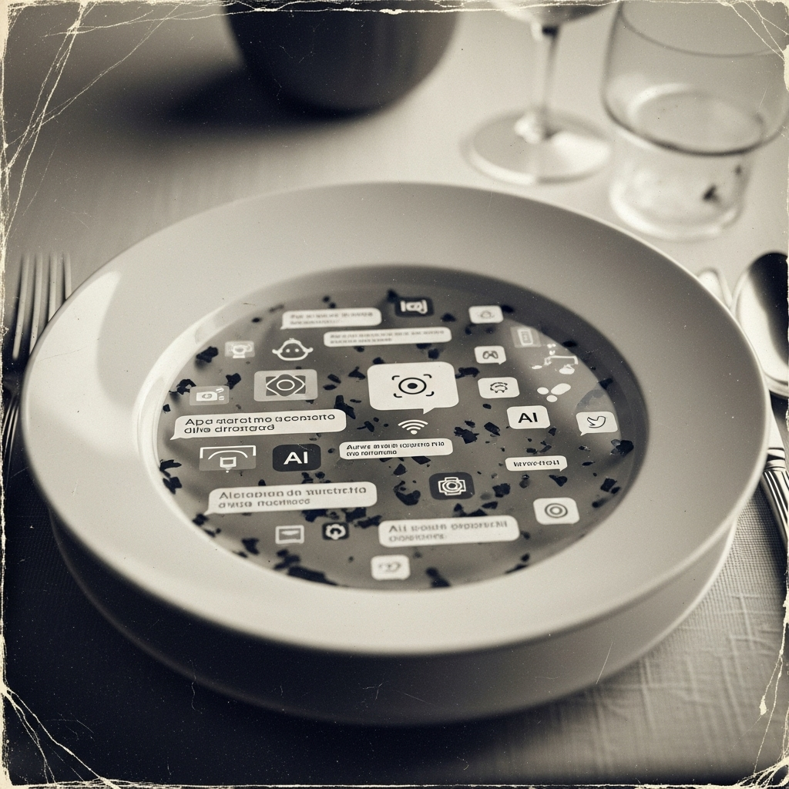

# Zuppa di prompt

Questo *repository* è la mia personale raccolta di ricette AI e *prompt*, curata per diverse intelligenze artificiali e completa di documentazione per la generazione di ulteriori *prompt*, risorse per la costruzione di agenti e appunti affini.

Nato il 7 dicembre 2024 come un block-notes per i miei esperimenti con l'IA, è un lavoro costantemente in corso che evolve di continuo con nuove "ricette".

## Contenuti e formati

* **Raccolte di Prompt:** Una vasta gamma di *prompt* testati e pronti all'uso per varie IA.
* **Documentazione e Guide:** Manualistica e risorse utili per affinare l'arte del *prompt engineering* e per approcciarsi alla costruzione di agenti AI.
* **Risorse Multilingua:** Contenuti sia in italiano che in inglese.
* **Formato Obsidian Vault:** L'intero “grimorio” è strutturato come un [vault di Obsidian](https://obsidian.md). 

## Utilizzo

Per esplorare **Zuppa di Prompt** al meglio e visualizzare correttamente le pagine, le immagini e i collegamenti interconnessi:

1.  **Clona o Scarica:** Effettua un clone completo del repository sul tuo computer oppure scarica l'archivio ZIP.
2.  **Apri con Obsidian:** Utilizza il software [Obsidian](https://obsidian.md) per aprire la cartella del repository come un vault.

Obsidian è un potente strumento per la gestione della conoscenza. Puoi utilizzare questa configurazione come base per creare la tua collezione personale di *prompt* e note.

## Navigazione Principale

Per orientarti tra i contenuti, puoi iniziare da questi indici (i link funzionano correttamente solo in Obsidian):

* [Indice-Link](Indice-Link.md): Una collezione di link utili e risorse esterne.
* [Indice-Manualistica](Indice-Manualistica.md): Guide e documentazione selezionata.
* [Indice-Prompt](Indice-Prompt.md): L'accesso diretto alle raccolte di prompt.

## Licenza

I miei appunti e le mie creazioni originali all'interno di questo repository sono distribuiti con licenza **Unlicense** (fai riferimento al file `LICENSE` per i dettagli).
Ogni altro materiale, allegato o risorsa di terze parti appartiene ai rispettivi legittimi proprietari ed è qui incluso nel rispetto delle relative licenze di distribuzione.

---

